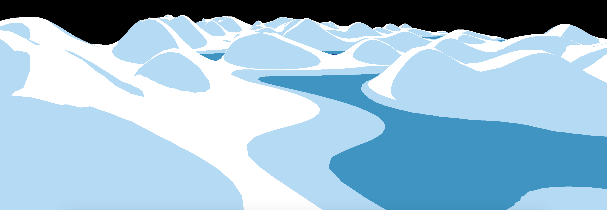

# Japanese Water Shader

The Japanese Water Shader creates a new water shader based on the famous painting [The Great Wave off Kanagawa](https://en.wikipedia.org/wiki/The_Great_Wave_off_Kanagawa) by [Katsushika Hokusai](https://en.wikipedia.org/wiki/Hokusai).

Access live online demo [here](https://cardadfar.github.io/japanese_water_shader/)
